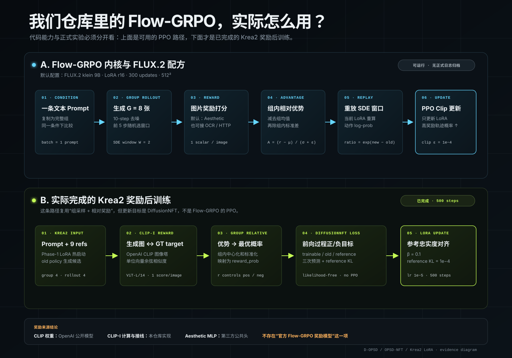

# 仓库中的 Flow-GRPO 与 Krea2 实际奖励后训练

## 结论

- 仓库包含 Flow-GRPO 的 SDE rollout、轨迹 replay、组内 advantage 和 PPO clip loss，以及一份 FLUX.2 Klein 配方。
- 当前归档没有 Flow-GRPO 正式运行日志，也没有 Krea2 Flow-GRPO 入口；`records/` 只有 D-OPSD 2000-step 和 OPSD-NFT 500-step。
- Krea2 的 500-step 奖励后训练使用组采样和组内相对优势，但参数更新采用 DiffusionNFT forward-process loss，不采用 Flow-GRPO 的轨迹 log-prob/PPO loss。

## Flow-GRPO 默认奖励

`dflow/config/recipe/flux2_t2i_flowgrpo.py` 默认启用 aesthetic reward：

- 图像编码器：`openai/clip-vit-large-patch14`
- 美学头：`trl-lib/ddpo-aesthetic-predictor/aesthetic-model.pth`
- 美学头是 `improved-aesthetic-predictor` 权重的 Hugging Face 镜像，不是 Flow-GRPO 作者提供的专用奖励模型。

框架还支持 OCR、CLIP-I reference fidelity 和外部 HTTP scorer，但是否启用由实验配置决定。

## Krea2 正式运行的奖励

`records/opsd-nft-500/config.json` 仅启用了 reference-fidelity reward：

- 使用 `openai/clip-vit-large-patch14` 的图像塔；
- 分别编码生成图和数据集的 ground-truth target；
- 对两侧向量做 L2 归一化后计算余弦相似度；
- 每个四候选组内做相对标准化，再映射为 DiffusionNFT 的 optimality probability。

因此准确说法是：**底层 CLIP checkpoint 是 OpenAI 公开模型，但 CLIP-I 奖励逻辑和 Krea2 数据接线是本仓库实现；它不是官方 Flow-GRPO 奖励模型。**

## 代码入口

- Flow-GRPO 配方：`dflow/config/recipe/flux2_t2i_flowgrpo.py`
- SDE rollout/replay：`dflow/rl/rollout.py`
- 组内优势：`dflow/rl/advantage.py`
- PPO objective：`dflow/rl/objective.py`
- Krea2 OPSD-NFT：`experiments/krea2_ref2img_opsd_nft.py`
- CLIP-I 奖励：`dflow/rewards/reference_fidelity.py`
